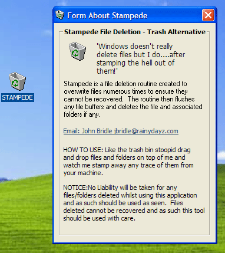



## Stampede \.\.Recycle Bin Alternative

### Description

A desktop based recycle bin alternative....with unrecoverable overwrite (For secure file deletion for privacy lovers) using pure API. Includes a very fast recursive file search class and fast file overwrite and deletetion class (ReUsable!)....faster overwrite speeds than any other versions I have seen here! Other than other code I have written!

NEEDS COMPILING TO DESKTOP BEFORE USE!
 
### More Info
 

             |
---                |---
**Submitted On**   |2003-11-07 15:35:46
**By**             |[Ghost\_Inside](https://github.com/Planet-Source-Code/PSCIndex/blob/master/ByAuthor/ghost-inside.md)
**Level**          |Intermediate
**User Rating**    |3.7 (11 globes from 3 users)
**Compatibility**  |VB 6\.0
**Category**       |[Windows System Services](https://github.com/Planet-Source-Code/PSCIndex/blob/master/ByCategory/windows-system-services__1-35.md)
**World**          |[Visual Basic](https://github.com/Planet-Source-Code/PSCIndex/blob/master/ByWorld/visual-basic.md)
**Archive File**   |[Stampede\_\_1668921172003\.zip](https://github.com/Planet-Source-Code/ghost-inside-stampede-recycle-bin-alternative__1-49725/archive/master.zip)

